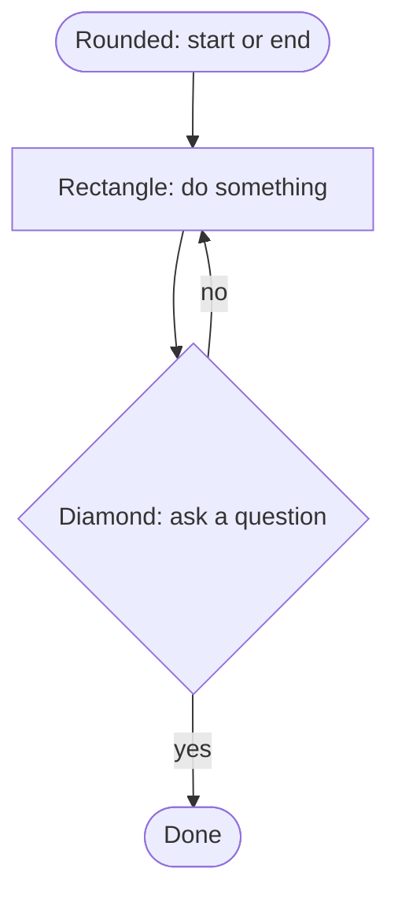
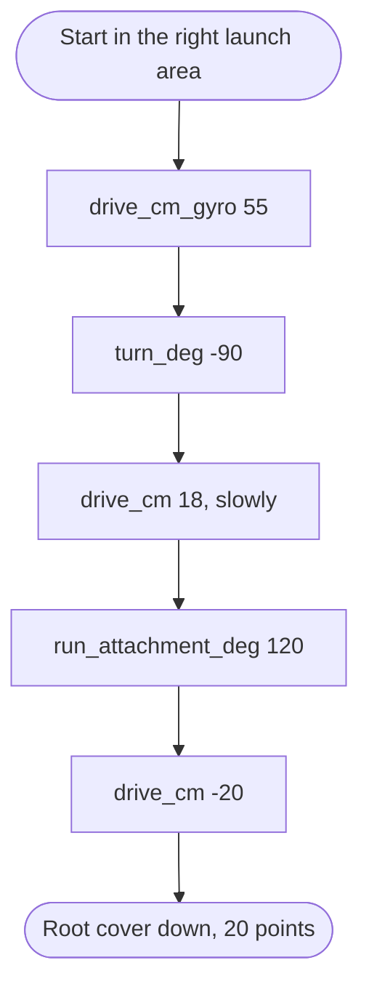
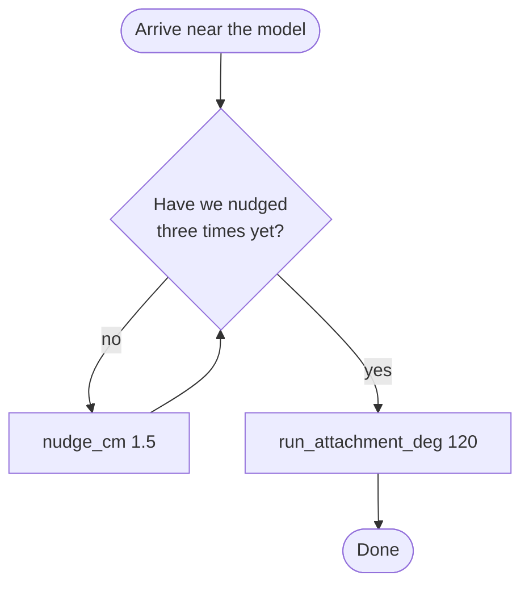
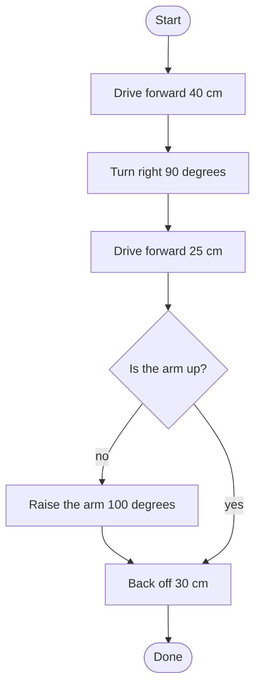

# 13. Flowcharts, and explaining your code

Two things in one lesson, because they turn out to be the same thing. A flowchart
is how you plan a program. It is also the single best object to put in front of a
judge.

## Draw it before you write it

Arguing about a picture is cheap. Arguing about code is not.

A flowchart is a plan for a mission, drawn as boxes and arrows. Five people can
look at it at once, spot that the robot ends up facing the wrong way, and fix it
with a pencil. Finding the same mistake in code costs a meeting.

## FIRST already has a worksheet for this

Page 28 of the Engineering Notebook is the **Pseudocode Worksheet**. It has:

- Mission Name and Mission Number
- Move 1 to Move 10
- A box headed `ROBOT PATH DIAGRAM`, with the instruction

> "Draw the route your robot will take to complete the mission."

Use it. Judges recognise it because FIRST wrote it, and it means you are not
inventing your own format the week before the event. It lives in
[`engineering-notebook/README.md`](../../engineering-notebook/README.md) and is
scheduled into Session 6 — see
[`docs/official-sessions.md`](../../docs/official-sessions.md).

The path diagram pairs with our
[field map](../../robot-game/field-map.md) and the printable wireframe grid: plan
the route on the grid, write the moves on the worksheet, draw the flowchart from
the moves.

## Four shapes is enough



| Shape | Means | In Python |
| --- | --- | --- |
| Rounded box | Start or end | the beginning and end of `run()` |
| Rectangle | Do one thing | `await drive_cm(30)` |
| Diamond | Ask a question | `if` or `while` |
| Arrow | What happens next | the next line down |

Two arrows leave a diamond and only one leaves a rectangle. That is the whole
grammar.

## A real mission, drawn

Here is M11 from [lesson 12](12-a-mission.md), as a flowchart:



And here is the same thing as code. Six boxes, six lines.

<div class="spike-run" markdown="1">

```python
async def run():
    """M11 — push the root cover down."""
    await drive_cm_gyro(55)
    await turn_deg(-90)
    await drive_cm(18, velocity=200)
    await run_attachment_deg(attachment1, 120)
    await drive_cm(-20)

await init_robot()
await run()
print(sim.pose())
```

</div>

Straight-line missions map one box to one line. That is the easy case.

## A question turns into a loop

Missions rarely stay straight. Suppose the robot should nudge forward until it is
actually touching the model, rather than trusting one distance:



The diamond with an arrow going back up is a loop. In Python:

<div class="spike-run" markdown="1">

```python
async def run():
    await drive_cm_gyro(45)
    await turn_deg(-90)
    await drive_cm(15, velocity=200)

    nudges = 0
    while nudges < 3:
        await nudge_cm()
        nudges = nudges + 1
        print("nudge", nudges)

    await run_attachment_deg(attachment1, 120)
    await drive_cm(-20)

await init_robot()
await run()
print(sim.pose())
```

</div>

The arrow going back is `while`. The arrow going forward is the condition
becoming false. Drawing it first makes the code obvious;
[lesson 7](07-loops.md) is the Python side of the same idea.

## Your turn: flowchart to code

Write the code for this:



Use a variable `arm_is_up` to stand in for the question.

<div class="spike-run" markdown="1">

```python
arm_is_up = False

await init_robot()
# your code here
```

</div>

??? question "Show one answer"

    ```python
    arm_is_up = False

    await init_robot()
    await drive_cm(40)
    await turn_deg(90)
    await drive_cm(25)

    if not arm_is_up:
        await run_attachment_deg(attachment1, 100)

    await drive_cm(-30)
    print(sim.pose())
    ```

    Both branches of the diamond meet again at "Back off 30 cm", so that line sits
    outside the `if`, not indented. Getting that wrong is the commonest flowchart
    mistake: drawing two paths that never join back up.

    Set `arm_is_up = True` and run it again. The arm line should be skipped.

## Your turn: code to flowchart

Now the other direction. Draw this on paper, using the four shapes:

```python
async def run():
    await drive_cm_gyro(60)
    for i in range(3):
        await turn_deg(120)
        await drive_cm(20)
    await run_attachment_deg(attachment1, 90)
```

??? question "What does the loop look like?"

    A diamond asking "done three times yet?", with the no-arrow going into the two
    action boxes and then back up to the diamond. The yes-arrow carries on down.

    ```mermaid
    flowchart TD
        A([Start]) --> B[drive_cm_gyro 60]
        B --> C{Done 3 sides?}
        C -- no --> D[turn_deg 120]
        D --> E[drive_cm 20]
        E --> C
        C -- yes --> F[run_attachment_deg 90]
        F --> G([Done])
    ```

    A `for` loop with a counter is a diamond, exactly like a `while`. The counting
    is hidden inside `range`, which is why `for` is shorter to write.

---

# Explaining it to judges

You will sit with judges for a Robot Design session and be asked about your code.
What follows is the code half only. The room, the timings and what to bring are in
[`docs/judging/robot-design-prep.md`](../../docs/judging/robot-design-prep.md).

## What is actually being scored

Three rows of the Robot Design rubric depend on how you talk about code. This is
FIRST's own wording, from `rubrics-color.pdf` page 3, for the **Accomplished**
box:

| Row | To score Accomplished |
| --- | --- |
| **CREATE** | "Clear explanation of innovative code and/or sensor use" |
| **ITERATE** | "Clear evidence of repeated testing of their robot and code" and "Clear evidence of improvements based on testing" |
| **COMMUNICATE** | "Detailed explanation of process and lessons learned" |

Read the CREATE row again. The word that separates Accomplished from Developing is
**innovative**. Developing says "Simple explanation of code and/or sensor use".
Describing what your code does is a Developing answer. Explaining a choice nobody
else made is an Accomplished one.

Using the gyro to hold a heading is that choice. So is measuring a calibration
scale per surface. Both are already in our toolkit.

## The three-sentence answer

Every question about code gets the same shape.

1. **What it does.** One sentence, plain.
2. **Why we chose it.** What the alternative was, and what was wrong with it.
3. **How we know it works.** A number.

The third sentence is the one teams miss, and it is the one that moves ITERATE.

### Weak and strong, on a real question

"How do you make it drive straight?" is listed in
[`robot-design-prep.md`](../../docs/judging/robot-design-prep.md).

**Weak:**

> We use a gyro.

True, and worth about two boxes on the rubric. It answers what, not why or how
well.

**Strong:**

> We drive with `drive_cm_gyro`, which reads the gyro sixty times a second and
> steers to keep the heading at zero. We started with plain `drive_cm`, but over a
> metre the robot ended up about four centimetres to the right, which was enough to
> miss the model. With gyro correction that came down to under one centimetre. We
> tuned the correction strength by hand and settled on 2.6 at speed 500, because
> higher values made it wobble.

Same fact. Three sentences of why and a number in each. Every one of those numbers
is something the team measured, and every one is in [lesson 10](10-gyro.md).

### Another one

"How do you know it's reliable?"

**Weak:** "It works most of the time."

**Strong:** "M11 scored nine out of ten in our last ten attempts. M04 was four out
of ten, so we stopped attempting it and spent the time on M08 instead."

The second answer also tells the judges you made a strategy decision from data.
That is two rubric rows from one sentence.

## What the code half brings into the room

Three things, and they are small:

- **A flowchart** for one mission, drawn by a student. On the Pseudocode
  Worksheet, or on paper. Judges can follow a flowchart in five seconds; they
  cannot read your code in five minutes.
- **One design log entry** showing a change and its effect.
  [`robot-design/design-log.md`](../../robot-design/design-log.md) has the format:
  problem, change, result, next. The result line needs a number.
- **A success rate** for each mission you attempt.

That is your ITERATE evidence. Without it, "we tested a lot" is an opinion.

## Everybody explains one part

The DESIGN row asks for "Clear evidence of building and coding skills in **all**
team members". One person who knows the whole program scores worse than five
people who each know one piece.

So split it before the day, and practise out loud:

| Part | Somebody should be able to explain |
| --- | --- |
| Driving straight | why the gyro version exists, with the numbers |
| Turning | why turns are counted in wheel degrees |
| Calibration | the measure-then-correct routine from [lesson 9](09-calibration.md) |
| Attachments | what the motor does and how far it moves |
| Structure | why `run` and `main` are separate |
| Testing | the success rates, from memory |

The record of who has actually done what is
[`docs/who-did-what.md`](../../docs/who-did-what.md). An empty row there is a
question somebody cannot answer in the room.

## Things that read badly

- **"Our coach wrote that bit."** Adults may teach. All work presented must be the
  students'. If nobody can explain a piece of code, take it out.
- **Reading the code aloud line by line.** Judges do not want a recital. They want
  the decision behind it.
- **"It never fails."** Nothing never fails, and judges have watched robots all
  day. Say what fails and what you did about it.
- **Silence from four of the five.** See the DESIGN row above.

## Your turn

Pick one thing your program does. Write the three-sentence answer for it. Then say
it out loud to somebody who was not in the room when you wrote it.

If the third sentence has no number in it, go and measure something.

## Words from this lesson

| Word | Meaning |
| --- | --- |
| flowchart | A plan drawn as boxes and arrows |
| pseudocode | The plan in plain words, before any code |
| branch | A place where the program chooses between two paths |
| rubric | The judges' scoring sheet, one tick per row |
| iterate | Test, learn, change, test again |
| evidence | Something you can show, not something you say |

--8<-- "includes/abbreviations.md"
